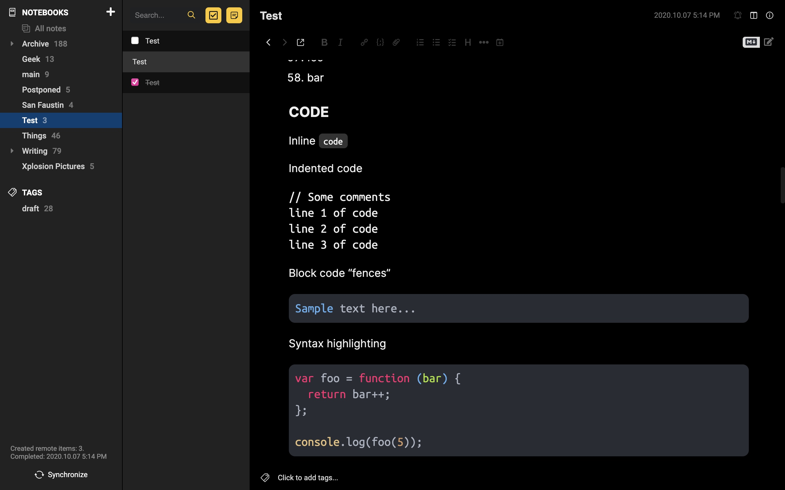
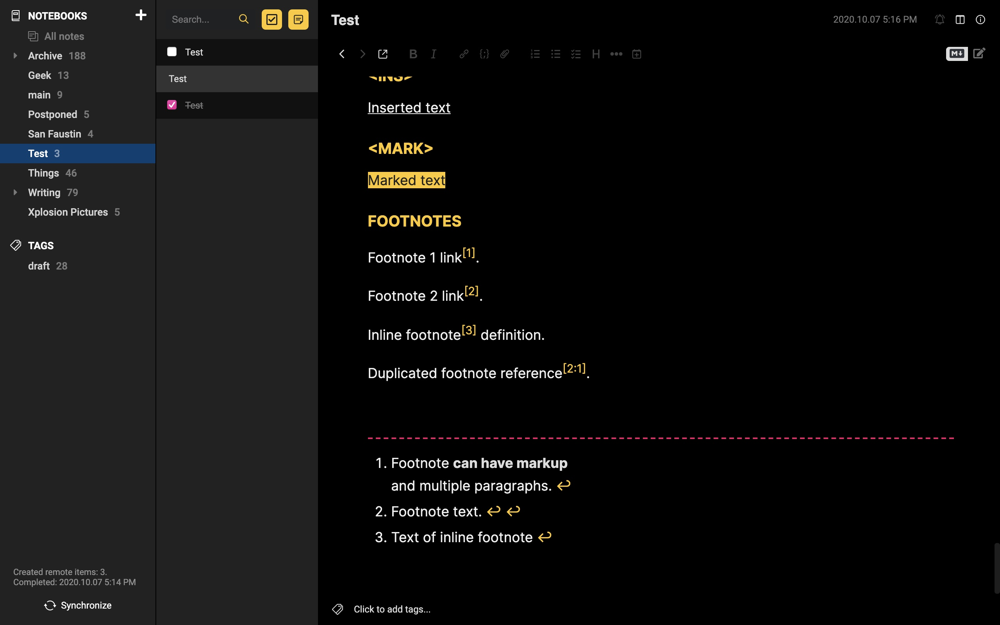
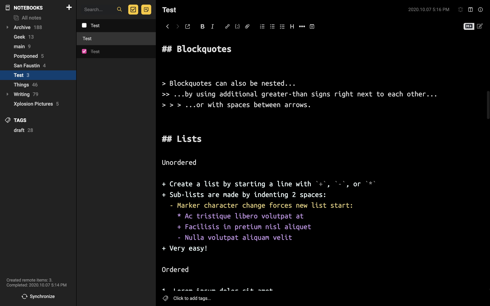

# Archived

This repository has been archived since I'm not using Joplin anymore, classes may change and styling may break.

# Joplin theme

Custom dark theme for [Joplin](https://joplinapp.org).

[`userchrome.css`](/userchrome.css) is used to style the entire app, [`userstyle.css`](/userstyle.css) is used to style the parsed markdown, instead.

In order to use these stylesheets, place them in `~/.config/joplin-desktop/`

---

## Screenshots

